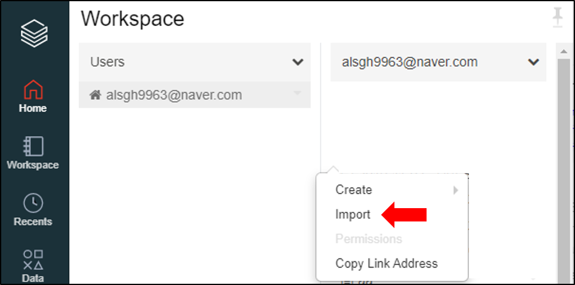
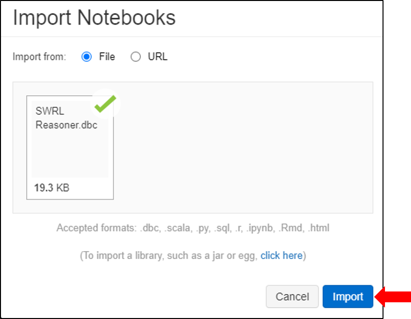
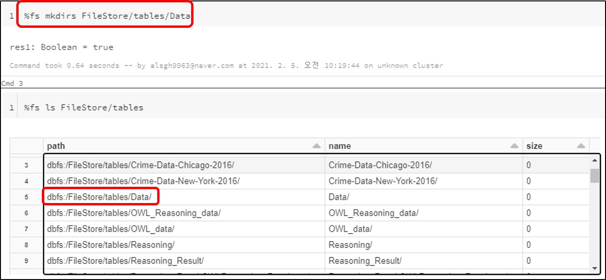
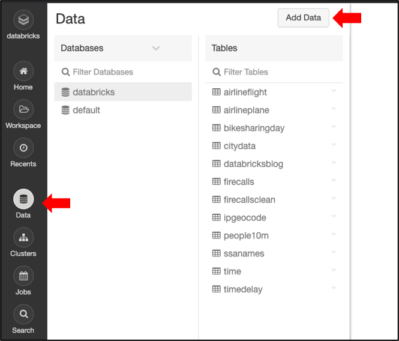
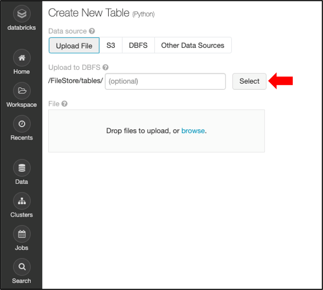
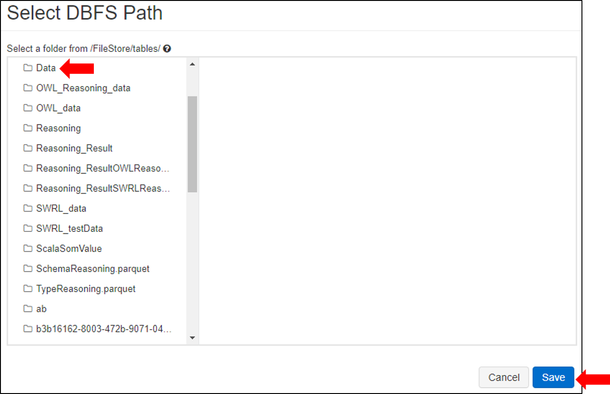
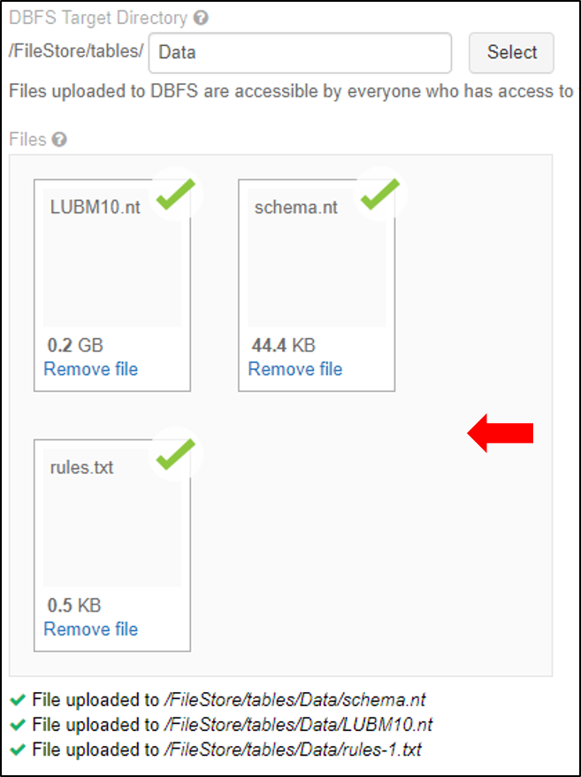

# SWRL_Reasoner

This is an SWRL Inference Engine Using Distributed Table Structure in Cloud Computing Environment.  
If you have any questions or comments, please fell free to contact us by email [alsgh9963@naver.com].

## Data Format

Data for this model is in `nt` format - basically Prolog syntax:

```
GraduateStudent47 type GraduateStudent
GraduateStudent47 name "GraduateStudent47"
GraduateStudent47 memberOf University7
GraduateStudent47 emailAddress "GraduateStudent47@Department16.University7.edu"
GraduateStudent47 telephone "xxx-xxx-xxxx"
GraduateStudent47 takesCourse GraduateCourse5
GraduateStudent47 undergraduateDegreeFrom University10
GraduateStudent47 advisor AssistantProfessor6
```

## Running

* __Azure Databricks 코드 업로드__

1. Workspace 여백 우클릭

<center></center>

2. SWRL-reasoner.dbc 파일 업로드 및 import

<center></center>

* __Cluster 생성 및 Spec__
```
Master Node : 1
Slave Node : 7
CPU : 2.4GHz 8Core (Node Per)
Memory : 56GB
```
* __Data 저장 공간 생성__

1. 업로드한 코드에서 저장공간 생성 셀 실행
```
%fs mkdirs /FileStore/tables/Dataata
```
<center></center>

* __Data 업로드__

1. 좌측 메뉴 Data클릭 및 Add Data 클릭

<center></center>

2. Select 클릭

<center></center>

3. 생성한 데이터 저장공간 OWL_data 선택 및 Save 클릭

<center></center>

4. Data파일 드래그앤드롭 방식으로 업로드

<center></center>

* __추론 시스템 실행__

1. 업로드한 코드 상단 메뉴에서 Run All 클릭


## Citation
```
본 연구는 2020년도 정부(과학기술정보통신부)의 재원으로 정보통신기술진흥센터의 지원을 받아 수행된 연구임 
(No.2019000067,대용량 지식그래프 자동완성을 위한 시맨틱 분석 추론기술 개발)
```
